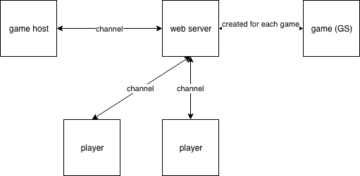

# Loca - Localization game

*Loca* is a game where you need to find all markers set by host player by walking around

You can find app deployed [here](http://blooming-dusk-12946.herokuapp.com/)

You can also run it locally.

Try

`mix deps.get`

`mix phx.server`

In loca-umbrella directory

## HOW TO PLAY

You need at least 2 people - host and player. Game supports multiple players with one host.

Host picks 1 to n markers then presses "Start game". A poput with game link will appear. Copy this link and send it to players. Player need to input their name and press _join game_ button.
Player is then redirected to color-based page.

1. Green means player is on right track to next marker
2. Red means player is not on right track to next marker
3. Grey means player is not moving
4. Yellow means player managed to walk to marker (note, you need to be in ~10m radius to capture the marker)
5. Pink means player has achieved final marker and won

All markers are shared between players, but only _current_ marker can be achieved by any player. First player to get to last one wins.

Host player will see dots with labels representing players. Label is name that player chose when joining game.

## Code itself
You can read more about code in specific projects README's

_Loca_ has all the backend code

# Loca Web

To start your server:
  * Go to loca_umbrella folder `cd loca_umbrella`
  * Install dependencies with `mix deps.get`
  * Install Node.js dependencies with `cd apps/loca_web/assets && npm install`
  * Start Phoenix endpoint from the loca_umbrella folder with `mix phx.server`

Now you can visit [`localhost:4000`](http://localhost:4000) from your browser.

You can also visit [`https://blooming-dusk-12946.herokuapp.com`](https://blooming-dusk-12946.herokuapp.com)

## Architecture

## Basic components

GameChannel:
  Communication between game host, players and server - used to send messages with game status and player localization.

GameController:
  - start_game - starts GameManager
  - check_position - get info about player position to nearest point
  - make_user & join - creates user and joins to started game

## How it works

### Game start

### Game

### Player perspective
  Player interface is dead simple, it just show colors
  - when there is no movement:

  

  - when player  moving in the right direction

  

  - when player is moving in the wrong direction

  

  - when player won

  
