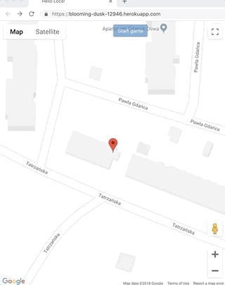

# Loca - Localization game

*Loca* is a game where you need to find all markers set by host player by walking around

You can find app deployed [here](http://blooming-dusk-12946.herokuapp.com/)

You can also run it locally (check _LocaWeb_ part of this readme for instructions)

## HOW TO PLAY

You need at least 2 people - host and player. Game supports multiple players with one host.

Host picks 1 to n markers then presses "Start game". A poput with game link will appear. Copy this link and send it to players. Player need to input their name and press _join game_ button.
Player is then redirected to color-based page.

1. Green means player is on right track to next marker
2. Red means player is not on right track to next marker
3. Grey means player is not moving
4. Yellow means player managed to walk to marker (note, you need to be in ~10m radius to capture the marker)
5. Pink means player has achieved final marker and won

All markers are shared between players, but only _current_ marker can be achieved by any player. First player to get to last one wins.

Host player will see dots with labels representing players. Label is name that player chose when joining game.

# Projects

## Loca

To play around with backend:
  1. Go to loca_umbrella folder `cd loca_umbrella`
  2. Install dependencies with `mix deps.get`
  3. Start `iex` with command `iex -S mix`.
  4. Now you can call `Loca.GameManager` functions (described below)
  5. There's `get_state/1` function that takes game_id and returns whole state. It was used for debug reasons, you can use it while playing around in console.

Backend is dead simple - it's single gen_server with few methods exposed:
  * start_game/1 - it accepts list of coordinates of markers. Returns game_id. Everytime it's called new gen_server is created to handle instance of game. Game_id is used for all other methods.
  * join_game/3 - Allows to join _user_ to game. It specifies _name_ of user and their _starting location_
  * check_position/3 - Checks position of _user_. This function will return information that will be presented in color code (see _Loca Web_ for more information)

All other methods are simply doing their part - like calculating distance to decide if player is going the right way.

## Loca Web

To start your server:
  * Go to loca_umbrella folder `cd loca_umbrella`
  * Install dependencies with `mix deps.get`
  * Install Node.js dependencies with `cd apps/loca_web/assets && npm install`
  * Start Phoenix endpoint from the loca_umbrella folder with `mix phx.server`

Now you can visit [`localhost:4000`](http://localhost:4000) from your browser.

You can also visit [`https://blooming-dusk-12946.herokuapp.com`](https://blooming-dusk-12946.herokuapp.com)

## Architecture

## Basic components

GameChannel:
  Communication between game host, players and server - used to send messages with game status and player localization.

GameController:
  - start_game - starts GameManager
  - check_position - get info about player position to nearest point
  - make_user & join - creates user and joins to started game

## How it works

### Game start

### Game

### Player perspective
  Player interface is dead simple, it just show colors
  - when there is no movement:

  

  - when player  moving in the right direction

  

  - when player is moving in the wrong direction

  

  - when player gets the marker

  

  - when player won

  

## Ideas for future developement?

  - Make distance calculation less prone to GPS inaccuracy
  - Add `you lost` information for other players
  - Change (or add new) marker behaviour; every player gets the same markers but with random order.
  - Add tips on where (N/NE/E/SE/S/SW/W/NW) player should go to be closer. This could be visible all the time, or after longer period of `further`/`no_movement` messages
  - Add points for every marker got and decide who won based on that.
  - Do better ending screen
  - Add distance_walked by player to show some stats after game was finished
