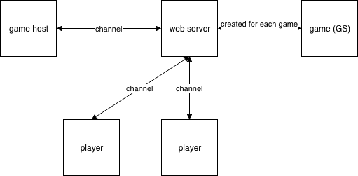
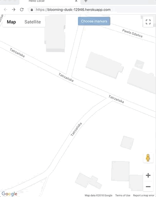
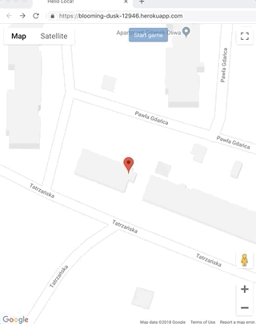

# Loca Web

To start your server:

  * Install dependencies with `mix deps.get`
  * Create and migrate your database with `mix ecto.create && mix ecto.migrate`
  * Install Node.js dependencies with `cd assets && npm install`
  * Start Phoenix endpoint with `mix phx.server`

Now you can visit [`localhost:4000`](http://localhost:4000) from your browser.

You can also visit [`https://blooming-dusk-12946.herokuapp.com`](https://blooming-dusk-12946.herokuapp.com)

## Architecture

## Basic components

GameChannel: 
  Communication between game host, players and server - used to send messages with game status and player localization.

GameController:
  - start_game - starts GameManager
  - check_position - get info about player position to nearest point
  - make_user & join - creates user and joins to started game

## How it works

